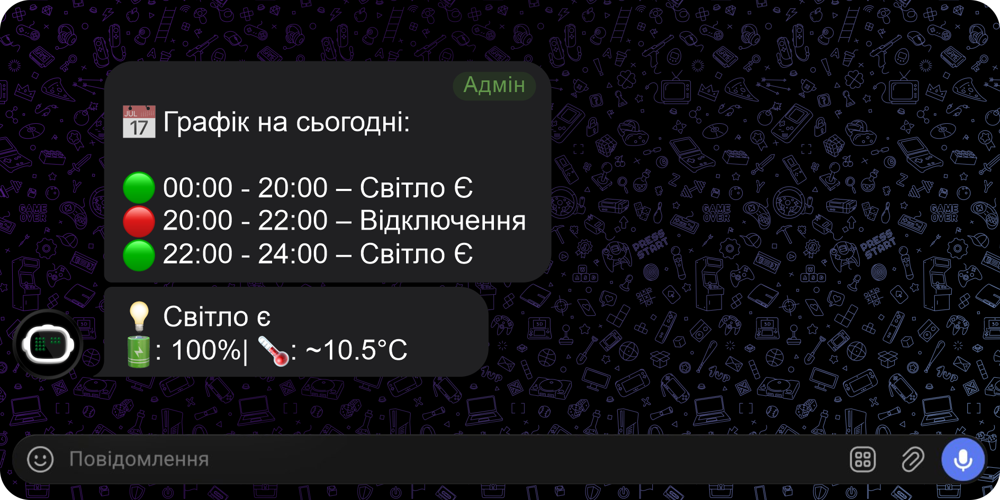

# ⚡ PowerBot - Автономний моніторинг світла на старому Android

♻️ Дайте друге життя старому телефону замість того, щоб він лежав у шухляді.
Власний сервер та Telegram Бот для автоматичного відстеження наявності електроенергії за допомогою старого Android-смартфона. 
Бот працює в середовищі Termux, аналізує статус живлення мережі та миттєво повідомляє про зміни в Telegram.

  

## ✨ Основні можливості
* 💡 **Сповіщення про світло**: миттєві повідомлення "Світло з'явилось/зникло".
* 📊 **Статус за запитом**: Отримуйте актуальну інформацію про стан мережі, рівень заряду телефона та температуру в приміщенні за допомогою швидких команд або емодзі.
* 📅 **Розумний графік**: Публікує актуальний розклад автоматично, як тільки з'являються офіційні дані на новий день. Жодних дублів та зайвого спаму.
* 👥 **Мульти-адмін**: можливість керування ботом декількома користувачами.
* 🛡️ **Захист від збоїв**: автоматичне відновлення роботи та система бекапів через `menu.sh`.
* ​🔄 **Оновлення в один дотик**: Кнопка в меню, яка миттєво встановлює найсвіжіші покращення та нові функції прямо з репозиторію.
* 🔐 **Приватність та Безпека**: Бот працює повністю локально на вашому пристрої. Жодних хмарних серверів, збору даних чи витоку ваших токенів — усе під вашим контролем.
* 💎 **Повністю безкоштовно**: Ніякої реклами, платних підписок чи прихованих платежів. Це відкритий проект від користувача для користувачів.

### Як налаштувати:

<b>🏗 Крок 1: Підготовка в Telegram</b>

Перш ніж налаштовувати телефон, необхідно створити "цифрову інфраструктуру" в самому Telegram. Виконайте ці дії по черзі:

<b>1. Реєстрація та створення групи:</b>
 <b>1.1</b> Реєстрація: Якщо у вас ще немає Telegram, встановіть його та зареєструйтеся за номером телефону.

<b>1.2</b> Створення групи:

• Натисніть на іконку "Олівця" або "Меню" та оберіть Нова група (New Group).

• Додайте в групу будь-кого з контактів (пізніше можна видалити).

• Назвіть групу (наприклад, "Мій Моніторинг Світла"). Бот буде надсилати повідомлення саме сюди.

 <b>2. Створення бота та отримання Токена (@BotFather):</b>
 <b>2.1</b> Знайдіть у пошуку Telegram офіційного бота @BotFather (біля імені має бути синя галочка). Натисніть Start.

<b>2.2</b> Відправте команду <pre>/newbot</pre>

<b>2.3</b> Назва бота: Введіть будь-яку назву (наприклад, Мій Світло Бот).

<b>2.4</b> Username бота: Введіть унікальне ім'я латиницею, яке обов'язково закінчується на _bot (наприклад, house_power_status_bot).

<b>2.5</b> Отримання Токена: BotFather надішле повідомлення з текстом "Use this token to access the HTTP API".

<b>2.6</b> Збережіть Токен (вдруге ви його ніде не побачите): Це довгий рядок символів  (наприклад: 123456789:AAAAAAA0A0Pw8FlVOdOpNys1L4RHkDjsuK0). Нікому не передавайте його!

 <b>3. Налаштування приватності (Privacy Mode):</b>
 Це критично важливо, щоб бот міг реагувати на ваші емодзі 💡 або 🛎️ у групі.

<b>3.1</b> У чаті з @BotFather введіть команду <pre>/mybots</pre>

<b>3.2</b> Оберіть свого бота зі списку.

<b>3.3</b> Натисніть Bot Settings -> Group Privacy.

<b>3.4</b> Натисніть Turn off. Ви маєте побачити: "Privacy mode is disabled". Це дозволить боту "бачити" повідомлення в групі.

<b>3.5</b> Поверніться назад і натисніть Group Permissions (опціонально, якщо немає цього меню просто додайте свій бот в групу і зробіть його адміном. Дайте право читати повідомлення).

<b>3.6</b> Переконайтеся, що активовано Read Messages (Читати повідомлення).

 <b>4. Додавання бота в групу:</b>
 <b>4.1</b> Відкрийте вашу створену групу.

<b>4.2</b> Натисніть на назву групи -> Add Members (Додати учасників).

<b>4.3</b> Знайдіть свого бота за його @username і додайте його.

<b>4.5</b> Важливо: Зробіть бота адміністратором групи. Це необхідно для того, щоб він мав стабільний доступ до читання чату та відправки повідомлень.

 <b>5. Отримання ID Адміністраторів:</b>
 Бот має знати, кого слухатись.

 <b>5.1</b> Знайдіть у пошуку бота @userinfobot.

<b>5.2</b> Натисніть Start. Бот миттєво пришле ваш числовий Id. (Приклад вигляду: 8536920320).

Якщо ви хочете, щоб ботом керувала декілька людей, вони також мають написати цьому боту і дати вам свій ID.

 <b>6. Отримання ID групи:</b>

 <b>6.1</b> Додайте в вашу групу бота @myidbot.

Як тільки ви його додасте, відправте в групу команду `/getgroupid@myidbot` він дасть ID вашої групи (приклад: "Your supergroup ID is: -1003792819819").

Важливо: ID групи завжди починається з мінуса та цифр -100....

Після цього обох допоміжних ботів (@myidbot та @userinfobot) можна заблокувати, вони більше не потрібні.

 <b>7. Безпека даних (Важливо!):</b>
 Тепер у вас є:

• Токен бота (ключ від управління).

• Ваш ID (ваш паспорт для бота).

• ID групи (адреса, куди писати).

 <b>⚠️ НІКОЛИ не передавайте Токен бота стороннім особам. Той, хто має токен, має повний доступ до вашого бота. Також не публікуйте його в коментарях або соцмережах. Ці дані знадобляться вам лише один раз — під час введення в інсталятор на телефоні.</b> 

<b>📱 Крок 2: Підготовка смартфона (Termux)</b>

Для роботи бота нам знадобиться старий Android-смартфон (Сім карта з доступом в інтернет), який постійно підключений до розетки, та програма, що дозволяє запускати серверний код.

 <b>1. Встановлення програм (Важливо!):</b>
 Не встановлюйте Termux з Play Store (там застаріла версія). Використовуйте F-Droid:

<b>1.1</b> Зайдіть на сайт та скачайте додаток [F-Droid](https://f-droid.org/uk/).

<b>1.2</b> Через F-Droid знайдіть та встановіть дві програми:

• Termux: основний термінал.

• Termux:API: спеціальне розширення, яке дозволяє боту бачити заряд батареї та статус зарядки.

 <b>2. Налаштування Android (щоб бот не "засинав"):</b>
 Android намагається економити заряд і може вимкнути бота через 10-15 хвилин після вимкнення екрана. Нам потрібно це заборонити:

<b>2.1</b> Зайдіть у Налаштування телефону -> Програми -> Termux.

<b>2.2</b> Знайдіть пункт Живлення або Батарея.

<b>2.3</b> Оберіть "Не обмежувати" (Unrestricted).

<b>2.4</b> Також у пункті Дозволи програми, дайте усі дозволи.

<b>2.5</b> Також у самому додатку Termux потягніть шторку сповіщень вниз і переконайтеся, що там написано "Acquire wakelock" (це не дає процесору заснути).

 <b>3. Перший запуск Termux:</b>
 <b>3.1 Відкрийте Termux.</b>

<b>3.2</b> Ви побачите чорний екран з текстом. Введіть наступну команду, щоб надати терміналу доступ до пам'яті телефону:

<pre>termux-setup-storage</pre>
(Натисніть "Дозволити" у вікні, що з’явиться).

<b>🚀 Крок 3: Встановлення та запуск бота</b>

Це найпростіша частина. Вам потрібно скопіювати лише одну команду ("one-liner"), яка зробить все за вас.

 <b>1.1</b> Скопіюйте цю команду:
<pre>pkg update -y && pkg upgrade -y</pre>
Вставте її в Termux (натисніть пальцем на екран і тримайте, поки не з’явиться кнопка Paste).
Натисніть Enter.
Що буде відбуватися:
Скрипт почне завантажувати необхідні інструменти і кілька разів зупиниться для підтвердження, введіть Y і натисніть Enter, скрипт продовжить завантаження.

 <b>1.2</b> Скопіюйте цю команду:
<pre>pkg install curl -y && curl -O https://raw.githubusercontent.com/Bombin1/PowerBot/main/menu.sh && chmod +x menu.sh && ./menu.sh</pre>
Вставте її в Termux (натисніть пальцем на екран і тримайте, поки не з’явиться кнопка Paste).
Натисніть Enter.

Що буде відбуватися:
Скрипт почне завантажувати необхідні інструменти (Python, Git). Це може зайняти 2-3 хвилини.

Майстер налаштування: Скрипт зупиниться і попросить вас ввести дані, які ми підготували в Кроці 1:

• Введіть TOKEN бота: вставте ваш довгий ключ від BotFather.

• Введіть ID Адмінів: вставте свій ID (якщо декілька — через кому).

• Введіть ID Групи: вставте ID, що починається з -100.

Як користуватися меню:
Після налаштування ви побачите меню:

Пункт 1 (Запустити бота): Натисніть "1" і Enter. Бот почне працювати. Ви побачите повідомлення "🚀 Бот запущений у фоні".

Пункт 4 (Логи): Якщо хочете перевірити, чи все добре, натисніть "4". Ви побачите останні дії бота.

☕ **Підтримка проекту**:
 Якщо бот став вам у нагоді, ви можете подякувати автору:
 👉 [На каву автору ☕](https://send.monobank.ua/jar/8WFAPWLdPu)
